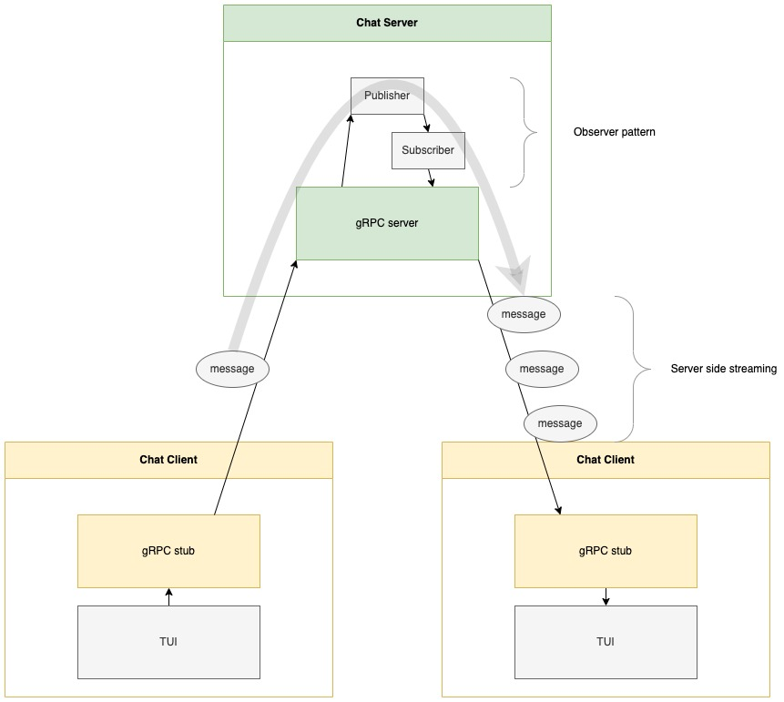

# practice-grpc-chat
This is the code repository for practicing gRPC by creating a chat application.

## Preparation and usage

### Preparation
To prepare the development environment, use VSCode "devcontainer."

(If only to run the server and client, Go 1.19 is the only requirement.)

### Usage
To run the server:
```
bash scripts/run_local_server.sh
```

If you want to run it on a specific adddress:
```
go run ./cmd/server -address 0.0.0.0:50052
```

To run the client:
```
bash scripts/run_default_client.sh
```

If you want to run it to a specific address and/or use a particular name:
```
go run ./cmd/client -address 0.0.0.0:50052 -name Hoge
```

## How the chat works

